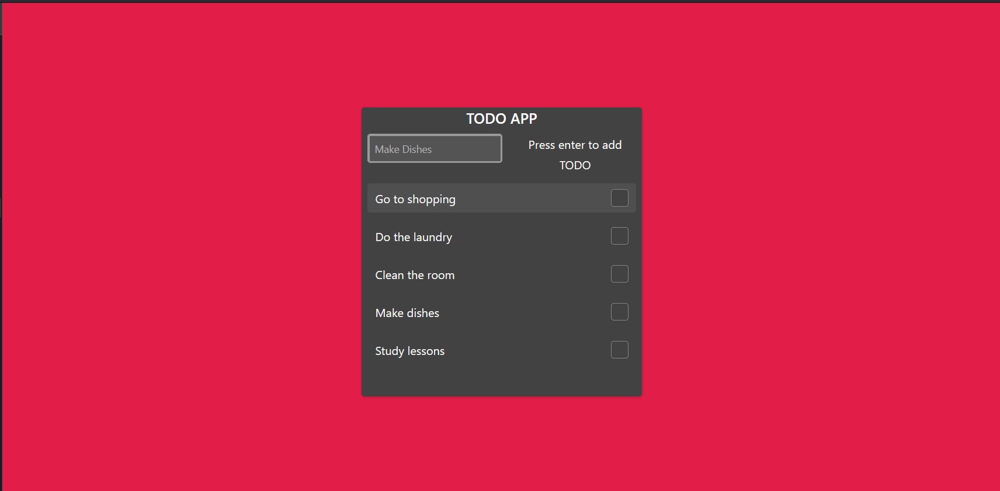

# MyTODO v0.1

This application is basic TODO tracker, it consists of features like task adding, task marking, and deleting
and sorting tasks

Tech stack for project:

- FAST.design
- Vue
- TS
- Vitest



## Project Setup

```sh
yarn install
```

### Compile and Hot-Reload for Development

```sh
yarn run dev
```

### Type-Check, Compile and Minify for Production

```sh
yarn run build
```

### Run Unit Tests with [Vitest](https://vitest.dev/)

```sh
yarn run test:unit
```

### Run End-to-End Tests with [Cypress](https://www.cypress.io/)

```sh
yarn run build
yarn run test:e2e # or `npm run test:e2e:ci` for headless testing
```

### Lint with [ESLint](https://eslint.org/)

```sh
yarn run lint
```
